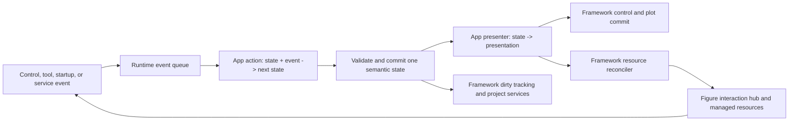

# UI Runtime And App Data Redesign

Status: proposed target architecture for the next LabKit-wide migration. The
current supported API remains documented in [ui.md](ui.md) until each migration
phase is implemented and validated.

This design replaces callback-by-callback coordination with one runtime-owned
event loop, one semantic state tree, one presentation commit, one
figure-scoped interaction hub, and one versioned project-document contract.
Apps continue to own scientific decisions, workflow order, calculations,
plots, and result meaning.

## Decision

LabKit should perform a framework-level redesign and migrate every public app.
Incrementally adding more callback helpers to the current surface will not
solve the underlying problem.

The redesign has five mandatory outcomes:

1. An app has one semantic state source. UI handles and tool objects never live
   in that state.
2. Every user or tool event enters one non-recursive queue and produces at most
   one state commit and one visible commit.
3. The framework owns control synchronization, callback suppression,
   interaction routing, resource cleanup, busy/error handling, dirty tracking,
   project save/open, and crash recovery.
4. Every app uses the same versioned project envelope and every result export
   uses the same result-manifest envelope.
5. The normal app-author surface becomes materially smaller. Compatibility
   wrappers may exist during migration but are not part of the final authoring
   model.

This will not remove app-specific workflow logic. DIC still decides what
matching means, Video Marker still decides annotation semantics, and
electrochem apps still decide formulas and columns. The framework removes the
mechanical sequencing around those decisions.

## Audit Baseline

The 2026-07-14 source audit found the following current facts:

- `labkit.ui` exposes 69 public functions across `runtime`, `layout`,
  `control`, `plot`, `interaction`, and `debug`, plus `labkit.ui.version`.
- `runtime` contains 62 MATLAB files and 7,432 lines; `interaction` contains 21
  files and 4,022 lines. Their size is not itself a defect, but too much of
  their mechanism remains visible to apps.
- Thirteen public UI functions have no production-app caller. Many other
  functions have only one production caller.
- Seven apps keep a closure-owned state variable in `definitionActions`, seven
  apps have a no-op visible-state update function, and twelve apps mutate UI
  controls directly from actions. The repository therefore supports multiple
  incompatible state/render models at once.
- The largest action registries are approximately 600-650 lines. The problem
  is not only line count: those files coordinate state, controls, tools,
  callback guards, redraws, and cleanup in the same scope.
- `services.dispatch` invokes another action directly rather than placing it
  behind the current action. Nested dispatch can therefore expose partially
  updated state and callback-order dependencies.
- Each interaction runtime owns an axes but captures figure-level callbacks.
  Multiple axes runtimes on one figure form an implicit fallback chain based
  on construction and activation order. A paired two-axes tool must coordinate
  both runtimes itself.
- The framework has `Startup`, `Hydrate`, `Snapshot`, `Utilities`, and action
  `effects` extension points, but production apps use only the same
  `Startup="startup"` pattern. The other abstractions are tested framework
  capability rather than adopted app architecture.
- Only Video Marker has a durable app-specific project file. It saves a copy of
  most runtime state and carries its own `schemaVersion`.
- Current app state may contain axes, ROI/editor handles, listeners, tool
  structs, or view caches. Examples exist in Figure Studio, DIC Preprocess,
  Curvature, Image Enhance, and Batch Crop.
- Result writers independently return variants of `results`, `manifest`,
  `manifestPath`, `outputFolder`, warnings, or app-specific JSON. Producer,
  input, parameter, schema, and provenance fields are not uniform.
- The existing generic snapshot format requires exact UI version, MATLAB
  release, platform, app version, and snapshot version matches. That is useful
  for same-build debugging but is unsuitable as a durable project format.

These are active architecture debts even though package-root app runners have
already been retired.

## Design Sources

The target is MATLAB-native and does not import third-party runtimes. It borrows
well-tested ideas from open-source systems without copying their implementation
or terminology wholesale.

| Source | Principle adopted | LabKit adaptation |
| --- | --- | --- |
| [The Elm Architecture](https://guide.elm-lang.org/architecture/) | Model, message, update, and view form one predictable loop. | Plain MATLAB structs and function handles; no language runtime or virtual DOM. |
| [Redux style guide](https://redux.js.org/style-guide/) | One serializable state tree, events describe what happened, transitions own state shape, and one conceptual transaction should not be many sequential dispatches. | One runtime store, action map, semantic event structs, and a queued commit loop. |
| [React state update queue](https://react.dev/learn/queueing-a-series-of-state-updates) | Finish an event before processing its visible update; avoid half-finished renders. | One action transaction followed by one presentation commit. |
| [React effect lifecycle](https://react.dev/learn/lifecycle-of-reactive-effects) | External resources synchronize to current state and have explicit start/stop cleanup. | Tool and listener resources are reconciled from presentation state and disposed by scope. |
| [Qt object ownership](https://doc.qt.io/qt-6/objecttrees.html) and [signal blocking](https://doc.qt.io/qt-6/qsignalblocker.html) | A parent owns resource lifetime; programmatic synchronization suppresses user signals and restores prior state safely. | Figure/target/tool resource scopes plus exception-safe semantic-callback suppression. |
| [VS Code Disposable API](https://code.visualstudio.com/api/references/vscode-api) | Subscriptions return disposables and owners dispose them as a group. | Runtime resources expose one cleanup operation and are registered immediately with a scope. |
| [Jupyter notebook format](https://nbformat.readthedocs.io/en/latest/format_description.html) and [conversion API](https://nbformat.readthedocs.io/en/latest/api.html) | Stable top-level envelope, major/minor format versions, additive minor changes, validation, and sequential conversion. | A framework project envelope plus an independent per-app payload version and ordered migrations. |
| [Redux Persist](https://github.com/rt2zz/redux-persist) and [Zustand persist](https://zustand.docs.pmnd.rs/reference/middlewares/persist) | Persist an explicit subset, separate storage from transforms, migrate before rehydration, and gate rendering until load finishes. | Persist the project slice only, keep codec and storage policy separate, and commit only after migration and validation. |
| [Frictionless Data Package](https://specs.frictionlessdata.io/data-package/) | A descriptor lists resources independently of their file formats; resource paths, media types, byte counts, hashes, and schemas have stable meanings. | Result manifests describe app-owned CSV, image, MAT, and JSON files without changing their domain schemas. |

The redesign deliberately does not introduce MATLAB classes, a global event
bus, code generation, a stringly typed `node(kind, ...)` layout language, or a
third-party reactive framework.

## Ownership Model



The app owns:

- project payload meaning
- event handlers and legal workflow transitions
- scientific calculations and domain validation
- prepared plot models and custom renderer functions
- accepted source formats and source validation
- result meaning, output filenames, and app-specific summaries
- payload migrations between app schema versions
- user-facing workflow text

The framework owns:

- launch/request/version plumbing
- event queue and transaction ordering
- semantic state storage and validation
- bindings and presentation reconciliation
- callback suppression during programmatic commits
- figure-wide pointer, wheel, drag, and interaction arbitration
- managed resource lifetime and cleanup
- busy, readiness, errors, close guards, and diagnostics
- dirty tracking, project save/open, autosave, and recovery
- portable source-reference mechanics
- project and result envelopes
- standard export file records and provenance

The framework must never branch on an app id or know DIC, electrochem, thermal,
gait, or annotation semantics.

## Canonical App Contract

### Definition

The target definition is a plain struct contract:

```matlab
function def = definition()
project = struct( ...
    "Version", 2, ...
    "Create", @example.projectData.createProject, ...
    "Validate", @example.projectData.validateProject, ...
    "Migrations", {{@example.projectData.upgradeV1ToV2}});

def = labkit.ui.runtime.define( ...
    "Id", "example", ...
    "Title", "Example App", ...
    "Project", project, ...
    "CreateSession", @example.appLifecycle.createSession, ...
    "Layout", @example.userInterface.buildWorkbenchLayout, ...
    "Actions", example.definitionActions(), ...
    "Present", @example.userInterface.presentWorkbench, ...
    "Renderers", struct("main", @example.userInterface.renderMain), ...
    "Start", @example.appLifecycle.start);
end
```

Target rules:

- `Project` is required for every app.
- `CreateSession`, `Start`, and `Renderers` are optional.
- `Actions` is a struct from semantic event id to a named function handle.
- `Present` is required and never mutates state or performs IO.
- `Startup` action arrays are replaced by one optional queued `Start` event.
- `Hydrate` is removed from the app contract until a real production workflow
  proves the need for deferred activation.
- `Project` replaces `Snapshot` as the durable schema declaration. The public
  `saveState/loadState` names remain as compatibility facades and route old
  snapshots through explicit import adapters.
- Utility-menu content is inferred from declared project, plot, screenshot,
  and debug capabilities rather than repeated in every definition.

### Public Entry Point

The target entry point delegates all framework plumbing to one launch call:

```matlab
function varargout = labkit_Example_app(varargin)
[varargout{1:nargout}] = labkit.ui.runtime.launch( ...
    @example.definition, @example.requirements, @example.version, varargin{:});
end
```

`launch` owns lightweight `requirements`, `version`, and `debug` requests,
contract checking, runtime creation, app-version title application, and output
normalization. This retires normal app calls to `dispatchRequest`, `run`, and
`applyVersionTitle`.

### Action Handler

An action has one normal signature:

```matlab
function state = loadSources(state, event, services)
paths = event.value;
items = example.sourceFiles.readSources(paths);
state.project.inputs.items = items;
state.session.selection.currentIndex = firstIndex(items);
end
```

Rules:

- The input state is the only semantic source of truth.
- The handler returns the entire next state.
- The handler does not retain closure state or call a refresh function.
- The handler does not read or write UI handles.
- `services.dispatch(event)` enqueues a later event; it never invokes another
  action recursively.
- Services may perform explicit IO, dialogs, notifications, logging, project
  operations, and task/resource requests. They do not expose the raw UI
  registry on the normal path.
- One user intent should be one event. Do not dispatch `setA`, `setB`, and
  `refresh` as three events for one conceptual operation.
- Invalid events are rejected based on current workflow state. Action handlers
  therefore act as small state-machine transitions rather than unconditional
  setters.

## Event And Commit Runtime

The runtime maintains one FIFO queue per app figure. Every event has a plain
framework-owned envelope:

```matlab
event = struct( ...
    "id", "sourceFilesChosen", ...
    "source", "user", ...       % user | tool | startup | service | test
    "target", "sourceFiles", ...
    "value", paths, ...
    "meta", struct());
```

App code may read but not replace `id`, `source`, or `target`. App-specific
extra values belong in `value` or `meta` and must be serializable if retained.

For each event the runtime performs exactly this sequence:

1. Enqueue the event. If another event is active, return immediately.
2. Dequeue one event and validate its id and payload shape.
3. Capture the last committed state for rollback and diagnostics.
4. Invoke the registered action once.
5. Validate the returned state root and reject runtime objects.
6. Commit the state once.
7. Compare `previous.project` with `next.project` and update dirty state.
8. Invoke the presenter once.
9. Apply control and plot changes inside callback suppression.
10. Reconcile managed interactions and other resources.
11. Record completion or restore the last committed state after an error.
12. Process the next queued event.

The visible UI never observes a partly committed semantic transaction.
Programmatic control writes never emit user semantic events. High-frequency
pointer motion stays inside the interaction hub; only configured preview or
commit events enter the semantic queue.

Explicit side effects such as a completed file export cannot be rolled back.
They must return a success/failure report and be recorded in the next semantic
state only after the side effect finishes.

## Canonical State Shape

Every running app has the same root shape:

```matlab
state = struct( ...
    "project", project, ...
    "session", session);
```

The framework creates this root. Apps do not add other root fields.

### Project State

`state.project` is durable, app-owned data. Its required buckets are:

```matlab
project = struct( ...
    "inputs", struct(), ...
    "parameters", struct(), ...
    "annotations", struct(), ...
    "results", struct(), ...
    "extensions", struct());
```

All buckets are present even when empty. Their meaning is:

- `inputs`: portable source records and app-owned imported semantic data
- `parameters`: choices required to repeat calculations or exports
- `annotations`: user-created points, masks, skeletons, intervals, labels,
  calibration, or other durable edits
- `results`: durable results worth reopening; large reproducible caches may be
  omitted and recomputed
- `extensions`: namespaced app data that does not fit the stable buckets

The framework validates the buckets and serialization safety but does not
interpret their domain fields.

### Session State

`state.session` is replaceable runtime-session data:

```matlab
session = struct( ...
    "selection", struct(), ...
    "workflow", struct(), ...
    "view", struct(), ...
    "cache", struct());
```

- `selection`: current item, selected row, active result, or current frame
- `workflow`: current mode and transient pending/error/status information
- `view`: restorable view choices such as preview mode; raw UI handles are not
  view state
- `cache`: disposable numeric/image/table caches derived from project data

Opening a project creates a fresh session and then lets the app derive session
defaults from the loaded project. Session changes do not make the project
dirty. An app may explicitly promote a session choice into project parameters
when that choice is part of reproducibility.

### Forbidden Values

Neither project nor session state may contain:

- graphics handles, figures, axes, ROI objects, or Java handles
- listeners, timers, `onCleanup`, file identifiers, or tool objects
- function handles, debug contexts, service structs, or runtime registries
- arbitrary class instances without an explicit framework serializer

Graphics objects, listeners, tools, subscriptions, and timers live only in the
runtime resource registry. Derived caches may be large, but they remain plain
MATLAB data and must be disposable.

## Bindings And Presentation

Layout remains a semantic tree. Its named constructors are readable and should
not be collapsed into a generic `node("field", ...)` API merely to reduce file
count.

Ordinary value controls may declare a state binding:

```matlab
labkit.ui.layout.field("gamma", "Gamma", "numeric", ...
    "Bind", "project.parameters.gamma")
```

The runtime then owns value normalization, finite-scalar checks, reading,
writing, callback suppression, and dirty tracking. An optional semantic event
may run after the bound value is committed when the app must perform additional
workflow logic. File loading, calculations, and exports are never inferred from
a binding.

The presenter returns plain presentation data:

```matlab
function view = presentWorkbench(state)
view = struct();
view.controls.run = struct("Enabled", canRun(state));
view.controls.status = struct("Text", statusText(state));
view.controls.results = struct("Data", resultRows(state));
view.previews.main = struct( ...
    "Renderer", "main", ...
    "Model", buildPlotModel(state));
view.interactions = desiredInteractions(state);
end
```

Presentation rules:

- `Present` is deterministic from state.
- The returned struct contains semantic ids, not handles.
- Bound values are read from state automatically and need not be repeated.
- The framework diffs presentation values and no-ops equal updates.
- Complex app plots use a registered renderer. The runtime supplies the axes;
  the app supplies only a prepared model and renderer function.
- A renderer may create ordinary noninteractive graphics. Interactive graphics
  belong to a managed interaction.
- App actions do not call `labkit.ui.control.*`, plot refresh helpers, or an
  app-local `refreshAll`.

This replaces the current coexistence of direct mutation, no-op render hooks,
and state-driven render hooks with one model.

## Figure-Scoped Interaction Hub

Every app figure has exactly one interaction hub. Preview axes register
semantic target ids with the hub when layout is built.

The hub owns:

- one set of figure-level pointer and wheel callbacks
- hover-based target routing without click-to-activate
- cursor-centered wheel zoom for the target under the pointer
- drag capture and release
- exclusive or grouped interaction sessions
- callback restoration and error cleanup
- programmatic update suppression
- listener/tool lifetime under resource scopes
- normalized tool events entering the runtime queue

Apps never construct `labkit.ui.interaction.runtime` and never set figure
`Window*Fcn` callbacks.

Interactions are controlled resources declared by presentation state:

```matlab
function interactions = desiredInteractions(state)
interactions = struct();
if state.session.workflow.mode == "matching"
    interactions.matchPoints = struct( ...
        "Kind", "pairedAnchors", ...
        "Targets", ["referencePreview", "movingPreview"], ...
        "Value", state.project.annotations.matchPoints, ...
        "Event", "matchPointsEdited", ...
        "ChangePolicy", "commit");
end
end
```

When a spec appears, the resource reconciler starts or updates it. When the
spec changes kind/targets or disappears, the prior resource is disposed before
the replacement starts. Programmatic `Value` synchronization never emits
`matchPointsEdited`; only user edits do.

Multi-axes tools acquire their targets atomically as one resource group. DIC
point matching therefore needs no popup, callback fallback chain, click-based
activation, `updatingEditors` flag, or app-owned listener cleanup.

Resource scopes are:

- `figure`: lasts until the app closes
- `target`: lasts while a semantic preview target exists
- `interaction`: lasts while one presentation interaction spec exists
- `event`: cleaned at the end of the current event, including on error

All resource creation registers cleanup before activation. Cleanup is
idempotent.

## Durable Project Document

### Three Different Artifacts

| Artifact | Purpose | Compatibility |
| --- | --- | --- |
| Runtime snapshot | Same-build debugging and temporary recovery of legacy state. | Strict and short-lived; compatibility import only after migration. |
| Project document | User-owned, editable work that can be reopened and upgraded. | Stable framework envelope plus ordered app payload migrations. |
| Result package | Immutable or append-only output from a run/export. | Stable result manifest plus app-owned files and summaries. |

These must not share one ambiguous “save state” contract.

### Stable `saveState/loadState` Facade

`labkit.ui.runtime.saveState` and `labkit.ui.runtime.loadState` should remain
the long-lived public persistence entry points. Keeping these names avoids
forcing launchers, utility menus, tests, private apps, and user scripts through
another API rename. Their contract becomes semantic state persistence, not a
promise to serialize the entire runtime struct.

The stable public calls remain simple:

```matlab
filepath = labkit.ui.runtime.saveState(fig)
filepath = labkit.ui.runtime.saveState(fig, filepath)
filepath = labkit.ui.runtime.loadState(fig)
filepath = labkit.ui.runtime.loadState(fig, filepath)
```

For a migrated app:

- `saveState` saves the durable `state.project` through the current project
  codec. It never saves controls, resources, caches, or arbitrary session
  state.
- `loadState` inspects the MAT-file inventory, detects a supported envelope,
  migrates it, validates it, constructs a fresh session, and commits once.
- The utility bar, handler `services.state`, autosave scheduler, crash recovery,
  and tests all use the same persistence engine behind this facade.
- Explicit save, recovery save, and test-memory save are storage policies over
  the same encoder/validator. They are not branches added to every app.

For an app not yet migrated, the current strict snapshot behavior remains
available. This gives the repository a per-app compatibility bridge during the
full migration rather than one flag day.

`loadState` detects format from trusted top-level MAT variable names and
validated envelope fields, not filename or extension heuristics:

1. `labkitProject` routes to the durable project reader.
2. `snapshot` routes to the current strict snapshot reader or a registered
   snapshot-to-project adapter.
3. An app-declared legacy variable such as `videoMarkerProject` routes to that
   app's named import adapter.
4. Unknown or ambiguous files are rejected before arbitrary payloads are
   loaded into live state.

The implementation should inspect the MAT inventory first and load only the
recognized variable. A legacy adapter is read-only: all subsequent writes use
the current `labkitProject` envelope.

The public facade must not grow a large `Mode` enumeration. Autosave and
recovery need internal policy objects because they choose a different target,
retention policy, and prompt behavior; they do not need different app-facing
serialization APIs. Codec, migration, storage, and UI prompting are separate
private components:

```text
saveState/loadState facade
        -> format detector and project codec
        -> app payload migrations and validation
        -> explicit-file | recovery | test-memory storage policy
        -> optional dialog/notification adapter
```

Automatic load means crash-recovery discovery, not silently reopening the last
explicit project on every launch. Silent last-project loading is surprising,
can trigger missing-source prompts, and can expose stale lab context. The
default policy should offer a validated recovery document; an app may opt into
a deliberate “reopen last project” user preference later.

### Project Envelope

Project MAT files contain exactly one variable named `labkitProject`:

```matlab
labkitProject = struct( ...
    "format", "labkit.project", ...
    "formatVersion", struct("major", 1, "minor", 0), ...
    "app", struct( ...
        "id", "video_marker", ...
        "payloadVersion", 2), ...
    "document", struct( ...
        "id", "stable-document-id", ...
        "createdAtUtc", "2026-07-14T18:00:00Z", ...
        "modifiedAtUtc", "2026-07-14T18:30:00Z", ...
        "revision", uint64(4)), ...
    "producer", struct( ...
        "appVersion", "3.0.0", ...
        "labkitUiVersion", "4.0.0", ...
        "matlabRelease", "R2025a", ...
        "platform", "maca64"), ...
    "sources", sourceRecords, ...
    "payload", state.project, ...
    "resume", struct(), ...
    "provenance", struct(), ...
    "extensions", struct());
```

Contract rules:

- `formatVersion.major` changes only for incompatible framework-envelope
  changes. A reader rejects a newer major version.
- `formatVersion.minor` changes for additive fields. Readers preserve unknown
  fields and may ignore fields they do not understand.
- `app.payloadVersion` is an integer owned by the app. It is the only app-data
  compatibility gate.
- App, UI, MATLAB, and platform versions in `producer` are provenance, not
  reasons to reject a project.
- Timestamps are UTC ISO-8601 strings on disk.
- `payload` always matches the canonical project buckets.
- `resume` is optional, non-authoritative session convenience data. It is not
  used to validate scientific results and may be discarded safely.
- Framework and app validators run before the live state changes.
- Unknown extension fields survive read-save cycles.

### App Project Spec And Migration

The app declares the current payload version, initial project factory,
validator, and one migration per version step. If current version is 4, the
migration list must define `1->2`, `2->3`, and `3->4`; versions may not be
skipped.

Each migration:

- accepts only the previous project payload
- returns only the next project payload
- is deterministic and GUI-free
- performs no file IO, dialogs, logging, or source resolution
- preserves unknown extension fields
- is directly unit tested with a synthetic prior-version payload

Open follows this order:

1. Load only `labkitProject` and validate the framework envelope.
2. Convert supported older framework major formats one version at a time.
3. Verify the target app id.
4. Upgrade the app payload one version at a time.
5. Validate the current app payload.
6. Resolve framework source records automatically where possible.
7. Collect unresolved required sources and perform one relink workflow.
8. Create a fresh session from the loaded project and optionally apply an
   app-declared best-effort `resume` adapter.
9. Replace the durable project; never shallow-merge it into current defaults.
10. Commit state, present once, mark clean, and register the project path.

A failed step leaves the existing live state unchanged.

The no-merge rule is intentional. Generic shallow/deep reconciliation can
silently combine incompatible old and new fields. Project migrations must
produce the complete current payload; the session factory supplies current
ephemeral defaults. An optional resume adapter may restore conveniences such
as current frame or selected item, but it must not resume a pointer drag,
listener, active tool resource, pending export, or cached image object.

### Source Records

External sources use framework records rather than raw path strings alone:

```matlab
source = struct( ...
    "id", "referenceImage", ...
    "role", "reference", ...
    "required", true, ...
    "mediaType", "image/tiff", ...
    "reference", portableReference, ...
    "fingerprint", struct( ...
        "bytes", uint64(0), ...
        "modifiedAtUtc", "", ...
        "sha256", ""), ...
    "metadata", struct());
```

Relative reference, original path, and same-folder filename remain resolution
candidates. Checksums are optional because large lab files must not be hashed
on every UI event. Apps validate domain metadata after a candidate resolves.

### Dirty State, Save, Autosave, And Recovery

- A committed change to `state.project` marks the document dirty
  automatically. Session-only changes do not.
- `saveState` and autosave persist an explicit allowlist: the project document
  plus optional best-effort resume data. They never blacklist individual
  runtime fields from a whole-state dump.
- Save validates the envelope and app payload, writes a temporary file in the
  destination folder, reads it back, then atomically replaces the target.
- Save As changes project identity/path only after the write succeeds.
- Close guards and title dirty markers are framework-owned.
- Autosave is a debounced framework policy, not an app callback. It writes a
  recovery document under a LabKit user-data directory keyed by app id and
  document id, never by a sensitive source filename.
- Autosave runs only after a successful semantic commit, while the event queue
  is idle, and never during an active drag, project load, or result export.
- Recovery writes use the same validation and atomic-write path as explicit
  saves and keep a bounded previous generation.
- A recovered document opens as dirty and never silently overwrites the user's
  explicit project.
- Video Marker's existing project and autosave formats become import adapters
  into this contract and are not used for new writes after its migration.

## Stable Result Manifest

Every export produces a framework result envelope even when the actual output
is CSV, image, MAT, JSON, or a multi-file directory. The app still owns actual
data files and result-specific columns.

For multi-file exports the standard manifest is `labkit_result.json`. For a
single primary file it is a sibling `<basename>.labkit.json` unless the app's
published compatibility contract requires a different additional filename.

```text
format: labkit.result
formatVersion: {major, minor}
app: {id, version}
run: {id, createdAtUtc, status}
project: {documentId, revision}              optional
inputs: [standard source descriptors]
parameters: app-owned reproducibility data
outputs: [standard output file records]
summary: app-owned JSON-safe summary
provenance: {LabKit, MATLAB, platform, warnings}
extensions: app-namespaced data
```

Each output file record contains:

```text
id, role, relativePath, mediaType, bytes, sha256, status, message
```

Rules:

- Paths inside a result package are relative when possible.
- The framework fills producer, run, project, size, checksum, status, and
  manifest-version fields.
- The app supplies output role, app parameters, and summary meaning.
- A failed per-item output remains a record with `status="failed"`; it is not
  silently omitted.
- Checksums are calculated after writing, not while controls are changing.
- Existing CSV columns and image names remain unchanged during migration. The
  standard manifest is additive until an explicit app-format version change.
- App-specific JSON payloads may continue as domain outputs; they are listed in
  the standard manifest rather than replacing it.

This gives downstream code a stable way to identify the producing app, schema,
inputs, parameters, files, partial failures, and provenance without teaching
the framework experiment-specific result schemas.

## Target App-Author API

The current 70-function surface should not be replaced with one giant vague
function. The target separates a small core from advanced renderer helpers.

| Area | Target normal author surface |
| --- | --- |
| Launch/runtime | `runtime.launch`, `runtime.define`, `runtime.saveState`, `runtime.loadState` |
| Layout | Keep the semantic layout constructors; group them in docs by shell, container, input, action, and output concepts. |
| State/control | Layout `Bind` plus the `Present` return contract; no direct `control.*` calls from normal apps. |
| Plot | Registered renderers receive axes and model; keep only a small advanced set of generic drawing/coordinate helpers. |
| Interaction | Presentation interaction specs; apps do not construct a runtime or own figure callbacks. |
| Dialog/log/error/project/result | Methods on the handler `services` struct, not global public helper functions. |
| Debug | Automatically supplied service and instrumentation; direct debug context remains test/advanced only. |

Final surface targets:

- no more than 32 public `labkit.ui` function files including layout
  constructors and compatibility-independent advanced helpers
- no more than 20 concepts in the new-app quick-start path
- zero production app calls to `labkit.ui.control.*`
- zero production app construction of `labkit.ui.interaction.runtime`
- zero production app calls to runtime dialog, title, dispatch, snapshot, or
  busy helpers outside the framework launch/services path

Compatibility wrappers remain until all apps, tests, and docs migrate. A
wrapper is removed only after repository search proves no supported caller.

## Private Framework Shape

The implementation should stay decomposed internally without creating more
public packages:

```text
+labkit/+ui/+runtime/private/eventQueue*.m
+labkit/+ui/+runtime/private/stateStore*.m
+labkit/+ui/+runtime/private/presentation*.m
+labkit/+ui/+runtime/private/resourceRegistry*.m
+labkit/+ui/+runtime/private/projectDocument*.m
+labkit/+ui/+runtime/private/resultManifest*.m
+labkit/+ui/+interaction/private/figureHub*.m
+labkit/+ui/+interaction/private/reconcileInteraction*.m
```

These are responsibility examples, not required filenames. Do not create tiny
pass-through helpers or one class per concept. Prefer plain structs, nested
functions, function handles, and `onCleanup` where they keep ownership clear.

## Required Framework Invariants

The migration is not complete until tests enforce all of these:

1. One figure has one event queue and one interaction hub.
2. Dispatch during an action queues and runs after the current visible commit.
3. One event causes at most one state commit and one presentation commit.
4. Programmatic presentation writes do not emit user events.
5. Action state and project payload contain no runtime resources.
6. Interaction resources clean up on replacement, error, target deletion, and
   figure close.
7. Wheel routing follows pointer target without click activation.
8. A grouped two-axes interaction acquires and releases both targets together.
9. Project loads migrate before live state changes and failed loads are atomic.
10. Newer compatible project minor fields survive read-save cycles.
11. App payload migrations are sequential, deterministic, and tested.
12. Project dirty state depends only on durable project changes.
13. Result manifests validate and represent partial failures explicitly.
14. Legacy snapshots and Video Marker projects remain readable through named
    import adapters during the compatibility window.
15. `loadState` detects supported formats safely; explicit save, autosave, and
    recovery share one codec without sharing prompt or retention policy.

## Non-Goals

- Do not move formulas, thresholds, plot meaning, result columns, or workflow
  wording into `labkit.ui`.
- Do not make all app state immutable by copying large image arrays on every
  pointer motion. The semantic commit contract matters; implementation may use
  MATLAB copy-on-write behavior and hub-local transient drag state.
- Do not persist raw UI layout, handles, listeners, or runtime services.
- Do not treat `saveState` as “serialize every field currently reachable from
  the app”. It saves the declared durable semantic state.
- Do not embed all source files or computed images in every project by default.
- Do not replace MATLAB UI with web technology or another language.
- Do not add asynchronous workers until a measured app workflow requires them.
- Do not add a public API merely because one app needs a private adapter.
- Do not rename all packages again. Migrate behavior behind the current
  `runtime/layout/control/plot/interaction/debug` ownership first, then remove
  obsolete public entries after usage reaches zero.

## Success Measures

The redesign should be judged by behavior and author burden rather than only
file or line counts:

- all public apps use the canonical state root and project spec
- no closure-owned duplicate semantic state
- no no-op presenter/render contract
- no UI handles/listeners/tools in semantic state
- no recursive action dispatch
- no app-owned figure callback restoration
- DIC paired matching works on the main page with hover-routed wheel behavior
- every app can save, reopen, and migrate a project document
- every export has a valid standard result manifest
- ordinary control changes require a binding, not paired get/set callbacks
- the largest action registries fall below the current watchlist because
  mechanical presentation and resource lifecycle code has disappeared
- focused framework tests prove ordering, cleanup, migration, and atomicity;
  app tests focus on workflow behavior rather than framework mechanics

The active phase plan, app migration order, and exact completion checklist live
only in [the agent migration ledger](../.agents/migration_guide.md). Once the
migration is complete, current contracts move into `ui.md`, `apps.md`, and
`architecture.md`, and the temporary route is removed from the ledger.
